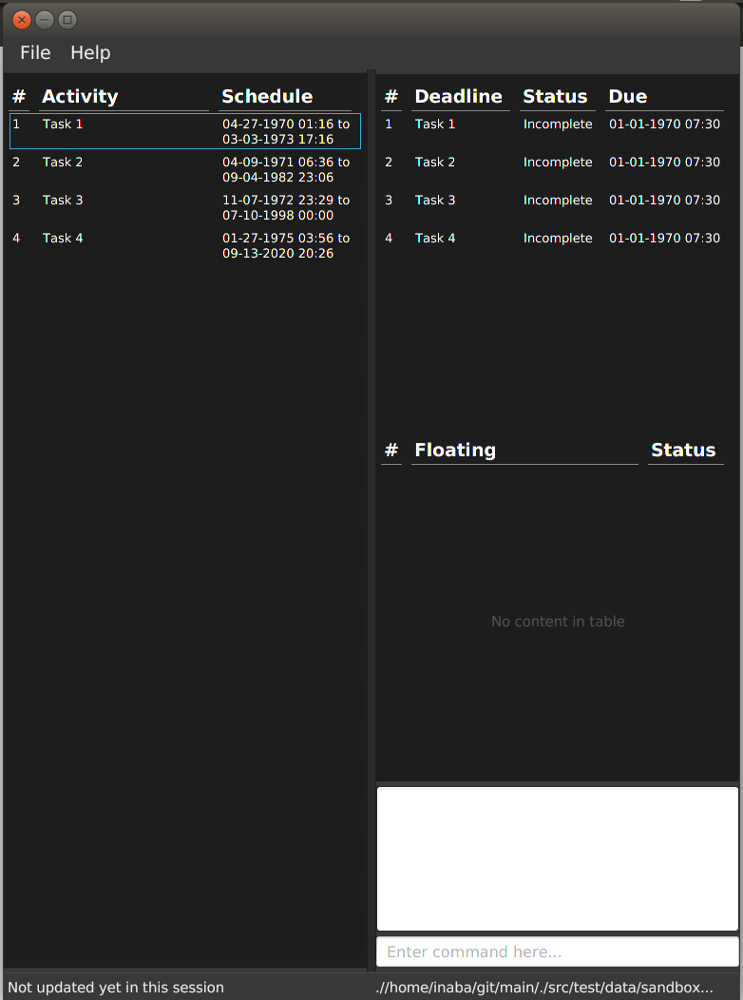

# TaskMan
<!--@@author A0140136W-->
 
<!--@@author-->

TaskMan is a task management application that aims to ease the way you record and search through your tasks. It is a desktop application which stores data locally.

TaskMan is specifically designed for users who favour working entirely from the keyboard. Instead of navigating through the application with mouse clicks, you simply need to type the right keywords to invoke the necessary commands.

#### Site Map
* [User Guide](docs/UserGuide.md) 
* [Developer Guide](docs/DeveloperGuide.md) 
* [Learning Outcomes](docs/LearningOutcomes.md) 
* [About Us](docs/AboutUs.md)
* [Contact Us](docs/ContactUs.md)

#### Acknowledgements

* Some parts of this sample application were inspired by the excellent 
  [Java FX tutorial](http://code.makery.ch/library/javafx-8-tutorial/) by *Marco Jakob*. 
  
* Credits to [Flaticon](http://www.flaticon.com/) for their fabulous emoticons.

# Originally Address Book (Level 4)

* This is a desktop Address Book application. It has a GUI but most of the user interactions happen using 
  a CLI (Command Line Interface).
* It is a Java sample application intended for students learning Software Engineering while using Java as 
  the main programming language. 
* It is **written in OOP fashion**. It provides a **reasonably well-written** code example that is 
  **significantly bigger** (around 6 KLoC) than what students usually write in beginner-level SE modules. 
* What's different from [Address Book Level 3](https://github.com/se-edu/addressbook-level3):
    * A more sophisticated GUI that includes a list panel and an in-built Browser.
    * More test cases, including automated GUI testing.
    * Support for *Build Automation* using Gradle and for *Continuous Integration* using Travis CI.

#### Licence : [MIT](LICENSE)
