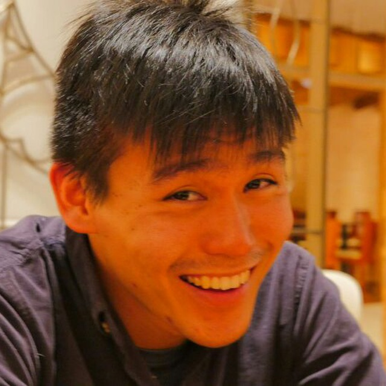
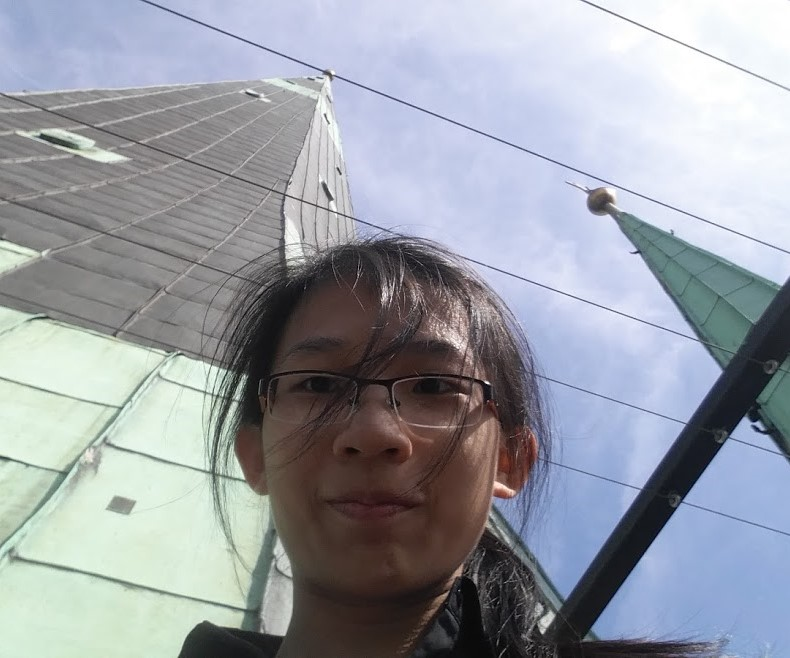

# About Us

We are a team based in the [School of Computing, National University of Singapore](http://www.comp.nus.edu.sg).

## Current Project Team

#### [Alex Fong Jie Wen](https://github.com/AlexFJW)
 
* Responsibilities: Team Lead
* Features implemented:
    * [Command for Creating Tasks](https://github.com/CS2103AUG2016-W10-C1/main/pull/15)
    *  Parsing for Relative DateTime [[File](https://github.com/CS2103AUG2016-W10-C1/main/blob/master/src/main/java/seedu/taskman/logic/parser/DateTimeParser.java)] [[File](https://github.com/CS2103AUG2016-W10-C1/main/blob/master/src/test/java/seedu/taskman/logic/parser/DateTimeParserTest.java)]
* Code written: [[functional code](https://github.com/CS2103AUG2016-W10-C1/main/blob/master/collated/main/A0139019E.md)][[test code](https://github.com/CS2103AUG2016-W10-C1/main/blob/master/collated/test/A0139019E.md)][[docs](https://github.com/CS2103AUG2016-W10-C1/main/blob/master/collated/docs/A0139019E.md)]

* Other major contributions:
	* Main reviewer for code reviews
    * Refactored of CommandParser for maintainability [[#70](https://github.com/CS2103AUG2016-W10-C1/main/pull/79)]
    * Refactored of LogicManagerTest for maintainability [[#80](https://github.com/CS2103AUG2016-W10-C1/main/pull/80)]
    * Overhauled Undo command for maintainability [[#85](https://github.com/CS2103AUG2016-W10-C1/main/pull/85)]
    * Migrated essential non-GUI tests from addressbook to that of the GTD app [[#77](https://github.com/CS2103AUG2016-W10-C1/main/pull/77)]

-----

#### [Inaba Kazuhiro](https://github.com/inaba1231)
 
* Responsibilities: Code Quality, UIUX
* Features implemented:
	* [Mark events](https://github.com/CS2103AUG2016-W10-C1/main/blob/master/src/main/java/seedu/taskman/logic/commands/MarkCommand.java)
	* [Track deadlines](https://github.com/CS2103AUG2016-W10-C1/main/blob/master/src/main/java/seedu/taskman/ui/DeadlinePanel.java)
* Code written: [[functional code](https://github.com/CS2103AUG2016-W10-C1/main/blob/master/collated/main/A0140136W.md)][[test code](https://github.com/CS2103AUG2016-W10-C1/main/blob/master/collated/test/A0140136W.md)][[docs](https://github.com/CS2103AUG2016-W10-C1/main/blob/master/collated/docs/A0140136W.md)]
* Other major contributions:
	* Change the UI of the AddressBook to that of the GTD app [[#88](https://github.com/CS2103AUG2016-W10-C1/main/pull/88)]

-----

#### [Lee Yi Min](https://github.com/leeyimin)
 
* Responsibilities: Testing
* Features implemented:
	* [List events](https://github.com/CS2103AUG2016-W10-C1/main/pull/14)
	* [Change storage location](https://github.com/CS2103AUG2016-W10-C1/main/pull/44)
	* [View storage location] (https://github.com/CS2103AUG2016-W10-C1/main/pull/86)
* Code written: [[functional code](https://github.com/CS2103AUG2016-W10-C1/main/blob/master/collated/main/A0121299A.md)]
[[test code](https://github.com/CS2103AUG2016-W10-C1/main/blob/master/collated/test/A0121299A.md)]
[[docs](https://github.com/CS2103AUG2016-W10-C1/main/blob/master/collated/docs/A0121299A.md)]
* Other major contributions:
    * Added Activity Class and refactored the app to work with Activity (https://github.com/CS2103AUG2016-W10-C1/main/pull/10)
	* Refactored command patterns in CommandParser and allowed non-compulsory fields to be optional (https://github.com/CS2103AUG2016-W10-C1/main/pull/29)

-----

#### [Lim Jia Yee](http://github.com/jia1)
 
* Responsibilities: Integration, Documentation
* Features implemented:
	* [Complete Command Logic and Tests](https://github.com/CS2103AUG2016-W10-C1/main/blob/master/src/main/java/seedu/taskman/ui/DeadlinePanel.java)
	* [History Command Logic and Tests](https://github.com/CS2103AUG2016-W10-C1/main/blob/new/command/history/src/main/java/seedu/taskman/logic/commands/HistoryCommand.java)
	* [Undo Command Logic (later fixed by Alex)](https://github.com/CS2103AUG2016-W10-C1/main/blob/master/src/main/java/seedu/taskman/logic/commands/UndoCommand.java)
* Code written: [[functional code](https://github.com/CS2103AUG2016-W10-C1/main/blob/master/collated/main/A0136070R.md)]
[[test code](https://github.com/CS2103AUG2016-W10-C1/main/blob/master/collated/test/A0136070R.md)]
[[docs](https://github.com/CS2103AUG2016-W10-C1/main/blob/master/collated/docs/A0136070R.md)]
* Other major contributions:
	* [Date Time Display Formatting for Frequency and Schedule](https://github.com/CS2103AUG2016-W10-C1/main/tree/master/src/main/java/seedu/taskman/model/event)

## Source Code Team

#### [Damith C. Rajapakse](http://www.comp.nus.edu.sg/~damithch)
 
**Role**: Project Advisor

-----

#### [Joshua Lee](http://github.com/lejolly)
 
Role: Developer  
Responsibilities: UI

-----

#### [Leow Yijin](http://github.com/yijinl)
 
Role: Developer  
Responsibilities: Data

-----

#### [Martin Choo](http://github.com/m133225)
 
Role: Developer  
Responsibilities: Dev Ops

-----

#### [Thien Nguyen](https://github.com/ndt93)
Role: Developer  
Responsibilities: Threading

-----

#### [You Liang](http://github.com/yl-coder)
 
Role: Developer  
Responsibilities: UI

-----

# Contributors

We welcome contributions. See [Contact Us](ContactUs.md) page for more info.

* [Akshay Narayan](https://github.com/se-edu/addressbook-level4/pulls?q=is%3Apr+author%3Aokkhoy)
* [Sam Yong](https://github.com/se-edu/addressbook-level4/pulls?q=is%3Apr+author%3Amauris)
