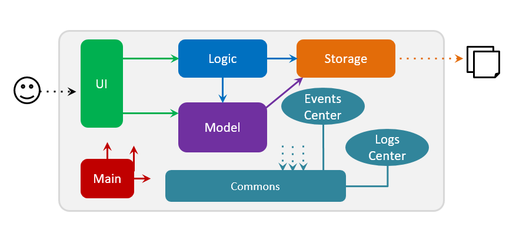
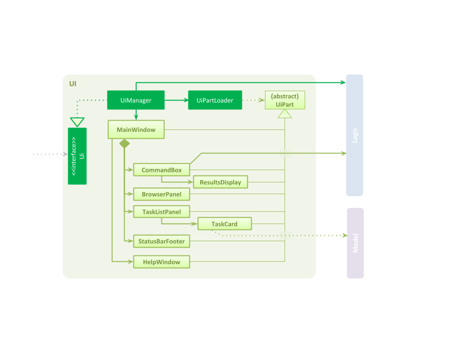
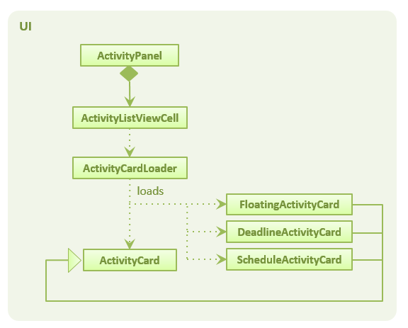
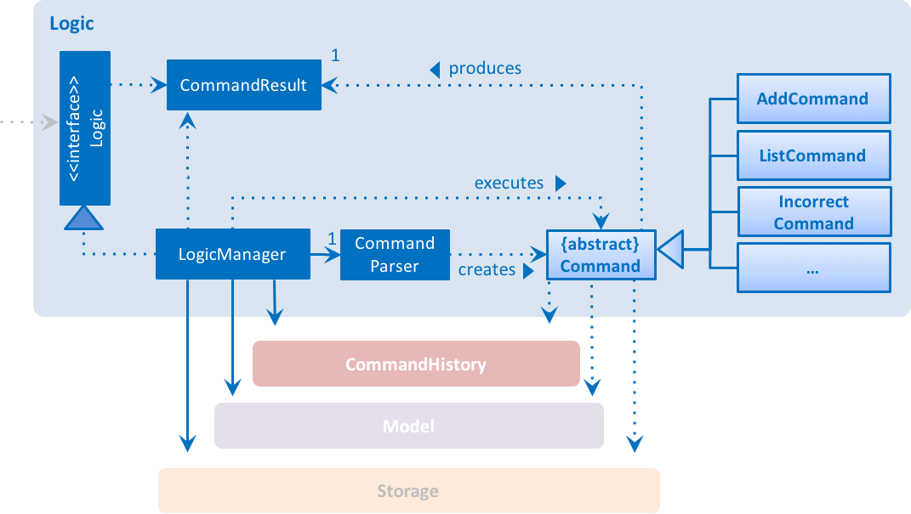
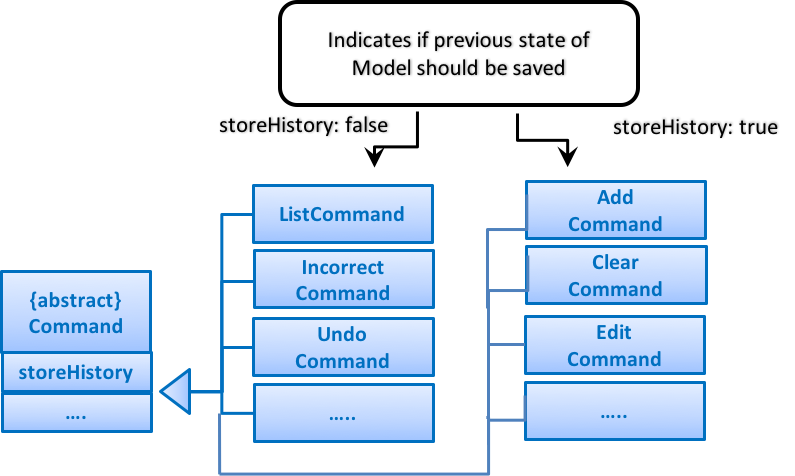
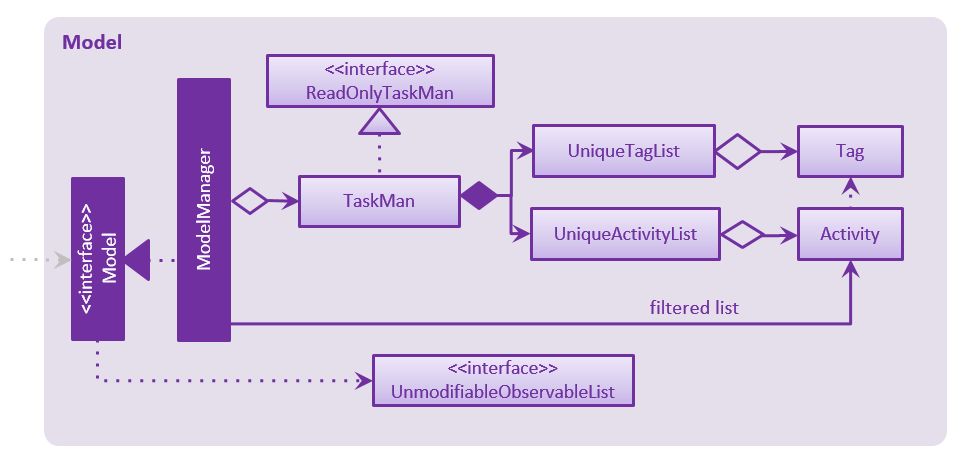
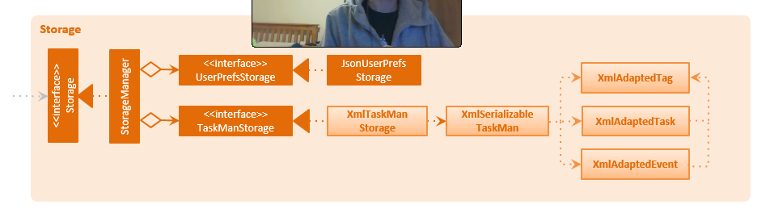
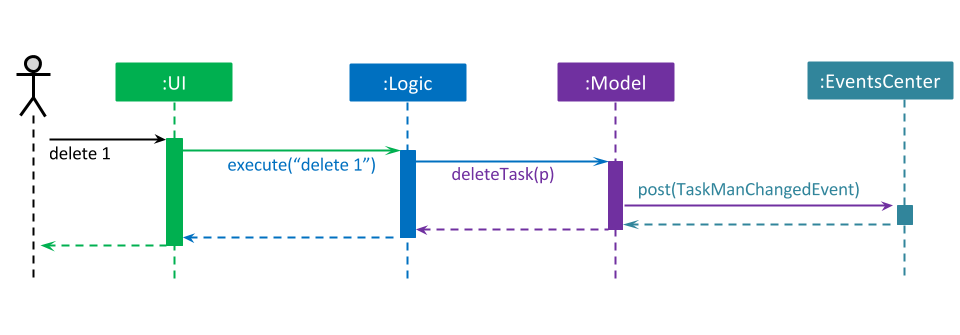
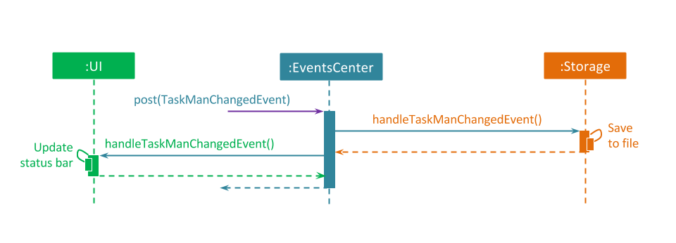

# Developer Guide 

* [Introduction](#introduction)
* [Setting Up](#setting-up)
* [Design](#design)
* [Implementation](#implementation)
* [Testing](#testing)
* [Dev Ops](#dev-ops)
* [Appendix A: User Stories](#appendix-a--user-stories)
* [Appendix B: Use Cases](#appendix-b--use-cases)
* [Appendix C: Non Functional Requirements](#appendix-c--non-functional-requirements)
* [Appendix D: Glossary](#appendix-d--glossary)
* [Appendix E: Product Survey](#appendix-e-product-survey)

## Introduction

TaskMan is a task manager for keyboard lovers. It is a Java desktop application which accepts inputs in the form of commands typed by the user. The GUI is for output.

This guide is for developers to understand the workings behind TaskMan. It describes the design, requirements, analysis of existing task managers, and the implementation of TaskMan. It will guide you with setting up the development environment for TaskMan and prime you towards your first patch.

Please refer to the [User Guide](docs/UserGuide.md) on how to use the application as an end-user. Having a go with the actual application also helps greatly when working on the business logic of the app. Do give it a try!

## Setting up

#### Prerequisites
You will need to install the following prerequisites to get started.

1. **JDK `1.8.0_60`**  or later 

    > Having any Java 8 version is not enough.  
    This app will not work with earlier versions of Java 8.
    
2. **Eclipse** IDE
3. **e(fx)clipse** plugin for Eclipse (Do the steps 2 onwards given in
   [this page](http://www.eclipse.org/efxclipse/install.html#for-the-ambitious))
4. **Buildship Gradle Integration** plugin from the Eclipse Marketplace

#### Importing the project into Eclipse
You can import the project into Eclipse by following the steps below:

0. Fork this repo, and clone the fork to your computer
1. Open Eclipse (Note: Ensure you have installed the **e(fx)clipse** and **buildship** plugins as given 
   in the prerequisites above)
2. Click `File` > `Import`
3. Click `Gradle` > `Gradle Project` > `Next` > `Next`
4. Click `Browse`, then locate the project's directory
5. Click `Finish`

  > * If you are asked whether to 'keep' or 'overwrite' config files, choose to 'keep'.
  > * Depending on your connection speed and server load, it can even take up to 30 minutes for the set up to finish
      (This is because Gradle downloads library files from servers during the project set up process)
  > * If Eclipse auto-changed any settings files during the import process, you can discard those changes.

## Design

### Architecture

 

First, let’s talk about the architecture of the whole application. You can refer to the **_Architecture Diagram_** given above for a quick overview of the high-level design of the app. 
Do read the following short descriptions to at least have a clear idea of the separation of concerns in the application.

The `Main` component comprises of one class, called [`MainApp`](../src/main/java/seedu/taskman/MainApp.java). It is responsible for:
* At app launch: Initializing the application’s components in the correct sequence, and connecting them up with each other.
* At shut down: Shuts down the components and frees resources where necessary.

[**`Commons`**](#common-classes) represents a collection of classes used by other components. You can also look here to find other helper classes. 
Two classes in this component play important roles at the architecture level.
* `EventsCenter`: You would need this class (written using [Google's Event Bus library](https://github.com/google/guava/wiki/EventBusExplained)) to enable communication between components using events (i.e. a form of Event Driven design)
* `LogsCenter`: You can use this class to write log messages to the App's log file.

The rest of the App consists four components.
* [**`UI`**](#ui-component) : The User Interface (UI) of the App. You should use this component to handle user interactions, display information and accept user feedback.
* [**`Logic`**](#logic-component) : The command executor. You should use this component to parse and execute commands entered by the user. 
* [**`Model`**](#model-component) : Holds the data of the App in-memory. You should store and handle the data which the user interacts with in this component.
* [**`Storage`**](#storage-component) : Reads data from, and writes data to the hard disk. You should handle file-writing and file-reading operations of the data in this component. 

Each of the four components:
* Defines its _API_ in an `interface` with the same name as the Component.
* Exposes its functionality using a `{Component Name}Manager` class.

For more information on each specific component, you can read the corresponding sections in this documentation. 

### UI component
<!--@@author A0140136W-->
 

**API** : [`Ui.java`](../src/main/java/seedu/taskman/ui/Ui.java)

The `UI` component is where you should be looking at if you are interested in how the application 
interacts with the user. The `UI` consists of a `MainWindow` that is made up of parts e.g. `CommandBox`, 
`ResultDisplay`, `ActivityPanel`, `StatusBarFooter`, etc. You can load all these UI parts, including the
`MainWindow`, using the `UiPartLoader` as they inherit from the abstract `UiPart` class.
<!--@@author-->

The `UI` component uses JavaFx UI framework. You can find the layout of these UI parts are in 
matching `.fxml` files that are in the `src/main/resources/view` folder. 
For example, the layout of the [`MainWindow`](../src/main/java/seedu/taskman/ui/MainWindow.java) is specified 
in [`MainWindow.fxml`](../src/main/resources/view/MainWindow.fxml).
<!--@@author A0121299A-->
 

You can load multiple `ActivityPanel` parts in the `MainWindow` and control 
the kind of display for the `Activity` objects in the panel through 
the `ActivityCardLoader` class.
<!--@@author-->
In summary, the `UI` component,
* Executes user commands using the `Logic` component.
* Binds itself to some data in the `Model` so that the UI can auto-update when data in the `Model` change.
* Responds to events raised from various parts of the App and updates the UI accordingly.

<!--@@author A0139019E-->
### Logic component

 

**API** : [`Logic.java`](../src/main/java/seedu/taskman/logic/Logic.java)

When input from the user is entered, the UI would call on the Logic component to act on the command entered. 
We use CommandParser to help create the appropriate Command object, depending on the input by the user. 

For the more complicated concrete Command subclasses, we implement prepare{Command} in the Command subclass 
to parse the fields entered by the user according to the type of command specifically. 

The Command objects can change the 'HistoryDeque', Model, Storage components and/or raise events. 

Given below is the Sequence Diagram for interactions within the Logic component for the execute("delete d1") API call.

 

Commands that have been successfully executed (checked with result.success) and 
have been flagged for storing (through the storeHistory field) will undergo an additional process as above. 

A `CommandHistory` object will be created, storing fields related to the state of the Model before the command was 
executed, as well as the input string for the command. This object will then be stored into the HistoryDeque. 

The HistoryDeque is utilized by the History and Undo commands, 
containing snapshots of the Model component at different states.

 

The above figure illustrates the storeHistory field for commands. 
The storeHistory field is set to true for some commands, and false for others.
View Command.java & the respective concrete Commands for more details.

In summary, the Logic Component:
Uses the CommandParser class to parse the user command.
Executes the resultant Command object.
Can affect the Model (e.g. adding a task), Storage (e.g. alter save location),  HistoryDeque and/or raise events.
Passes result of the command execution as a CommandResult object to the UI component.
1. `Logic` uses the `Parser` class to parse the user command.
2. This results in a `Command` object which is executed by the `LogicManager`.
3. The command execution can affect the `Model` (e.g. adding a task) and/or raise events.
4. The result of the command execution is encapsulated as a `CommandResult` object which is passed back to the `Ui`.

<!--@@author-->

### Model component
<!--@@author A0121299A-->
 

**API** : [`Model.java`](../src/main/java/seedu/taskman/model/Model.java)

You should handle all the data which the user interacts with (i.e. tasks, events and tags) 
here in the `Model` component. We use `TaskMan` to store the core data for the application and 
`ModelManager` uses the core data from `TaskMan` to produce sorted and filtered lists 
(using `UnmodifiableObservableList<Activity>`) for the UI components. You should ensure
changes to the core data of `TaskMan` should be made through the `Model` interface.

 

`Activity` is a wrapper class for `Task` and `Event` objects. All three classes inherit the `ReadOnlyEvent` interface. 
You can view `Task` as an extension of `Event`, which has an additional 
optional `Deadline` and compulsory `Status` field.
<!--@@author-->
In summary, the `Model`,
* stores the TaskMan data.
* exposes a `UnmodifiableObservableList<ReadOnlyTask>` that can be 'observed' e.g. the UI can be bound to this list
  so that the UI automatically updates when the data in the list change.
* does not depend on any of the other three components.

### Storage component
<!--@@author A0121299A-->
 

**API** : [`Storage.java`](../src/main/java/seedu/taskman/storage/Storage.java)

You should use the `Storage` component to handle the file-writing and file-reading 
operations required for `TaskMan`. Currently the `StorageManager` has two other parts: 
`UserPrefStorage` for reading and writing user preferences and `TaskManStorage` 
for reading and writing TaskMan data.
<!--@@author-->

In summary, the `Storage` component,
* can save `UserPref` objects in json format and read it back.
* can save the TaskMan data in xml format and read it back.

### Common classes

Classes used by multiple components are in the `seedu.taskman.commons` package.
This includes classes such as `EventsCenter`, `LogsCenter`, `Config` and other utility classes. 

#### EventsCenter

We use the Event Driven approach in the application to help reduce direct coupling between components. 

You can follow through this example to understand how it works. The following _Sequence Diagram_ below 
shows how the components interact for the scenario where the user issues the command `delete d1`.

>You can see that the `Model` simply raises a `TaskManChangedEvent` when the data in TaskMan in changed, 
    instead of asking the `Storage` to save the updates to the hard disk.

The diagram below shows how the `EventsCenter` reacts to that event, which eventually results in the updates
being saved to the hard disk and the status bar of the UI being updated to reflect the 'Last Updated' time.  

> Note how the event is propagated through the `EventsCenter` to the `Storage` and `UI` without `Model` having
  to be coupled to either of them. This reduces direct coupling between components, which helps to
   make the code base more maintainable.
   
<!--@@author A0121299A-->
#### Config

We designed the `Config` class using the Singleton pattern, to reduce any direct coupling 
required between `Config` and the other major components. It has its own file-reading and 
file-writing mechanism as it needs to be initialised before the other components. 
`Config` extends from `ConfigData`, which objects you can use to contain the data for `Config`. 
<!--@@author-->
## Implementation

### Logging

We are using `java.util.logging` package for logging. The `LogsCenter` class is used to manage the logging levels
and logging destinations.

* The logging level can be controlled using the `logLevel` setting in the configuration file.
  (See [Configuration](#configuration))
* The `Logger` for a class can be obtained using `LogsCenter.getLogger(Class)` which will log messages according to
  the specified logging level.
* Currently, log messages are output through: `Console` and to a `.log` file.

**Logging Levels**

* `SEVERE` : Critical problem detected which may possibly cause the termination of the application
* `WARNING` : Can continue, but with caution
* `INFO` : Information showing the noteworthy actions by the App
* `FINE` : Details that is not usually noteworthy but may be useful in debugging
  e.g. print the actual list instead of just its size

### Configuration

Certain properties of the application can be controlled (e.g App name, logging level) through the configuration file 
(default: `config.json`).

## Testing

Tests can be found in the `./src/test/java` folder.

**In Eclipse**:
> If you are not using a recent Eclipse version (i.e. _Neon_ or later), enable assertions in JUnit tests
  as described [here](http://stackoverflow.com/questions/2522897/eclipse-junit-ea-vm-option).

* To run all tests, right-click on the `src/test/java` folder and choose
  `Run as` > `JUnit Test`
* To run a subset of tests, you can right-click on a test package, test class, or a test and choose
  to run as a JUnit test.

**Using Gradle**:
* See [UsingGradle.md](UsingGradle.md) on how to run tests using Gradle.

We have two types of tests:

1. **GUI Tests** - These are _System Tests_ that test the entire App by simulating user actions on the GUI. 
   These are in the `guitests` package.
  
2. **Non-GUI Tests** - These are tests not involving the GUI. They include,
   1. _Unit tests_ targeting the lowest level methods/classes.  
      e.g. `seedu.taskman.commons.UrlUtilTest`
   2. _Integration tests_ that are checking the integration of multiple code units 
     (those code units are assumed to be working). 
      e.g. `seedu.taskman.storage.StorageManagerTest`
   3. Hybrids of unit and integration tests. These test are checking multiple code units as well as 
      how the are connected together. 
      e.g. `seedu.taskman.logic.logicmanager.LogicManagerTestBase`
  
**Headless GUI Testing** :
Thanks to the [TestFX](https://github.com/TestFX/TestFX) library we use,
 our GUI tests can be run in the _headless_ mode. 
 In the headless mode, GUI tests do not show up on the screen.
 That means the developer can do other things on the Computer while the tests are running. 

 See [UsingGradle.md](UsingGradle.md#running-tests) to learn how to run tests in headless mode.
  
## Dev Ops

### Build Automation

See [UsingGradle.md](UsingGradle.md) to learn how to use Gradle for build automation.

### Continuous Integration

We use [Travis CI](https://travis-ci.org/) to perform _Continuous Integration_ on our projects.
See [UsingTravis.md](UsingTravis.md) for more details.

### Making a Release

Here are the steps to create a new release.
 
 1. Generate a JAR file [using Gradle](UsingGradle.md#creating-the-jar-file).
 2. Tag the repo with the version number. e.g. `v0.1`
 2. [Create a new release using GitHub](https://help.github.com/articles/creating-releases/) 
    and upload the JAR file you created.
   
### Managing Dependencies

A project often depends on third-party libraries. For example, TaskMan depends on the
[Jackson library](http://wiki.fasterxml.com/JacksonHome) for XML parsing. Managing these _dependencies_
can be automated using Gradle. For example, Gradle can download the dependencies automatically, which
is better than these alternatives. 
a. Include those libraries in the repo (this bloats the repo size) 
b. Require developers to download those libraries manually (this creates extra work for developers) 

## Appendix A : User Stories

Priorities: High (must have) - `* * *`, Medium (nice to have)  - `* *`,  Low (unlikely to have) - `*`

Priority | As a ... | I want to ... | So that I can...
-------- | :-------- | :--------- | :-----------
`* * *` | new user | see usage instructions | refer to instructions when I forget how to use the App
`* * *` | user | add a new task by specifying a task title only | record tasks that have self-explanatory titles or no deadlines
`* * *` | user | edit a task | adapt to changes
`* * *` | user | delete a task | remove tasks that I no longer need
`* * *` | user | complete a task | hide it from the list of tasks
`* * *` | user | find a task by title | locate details of tasks without having to go through the entire list
`* * *` | user | find a task by category | locate details of tasks without having to go through the entire list
`* * *` | user | find a task by deadline | locate details of tasks without having to go through the entire list
`* * *` | user with many tasks | sort tasks by deadline | locate an urgent task easily
`* * *` | user | have similar functional support for "variations" of tasks | manage events
`* *` | user | select tasks from the list of tasks | conduct bulk actions on them conveniently
`* *` | user | type (shorter) variations of my commands | type my commands more efficiently
`* *` | user | undo my action | return to the previous state(s) after I have done something undesirable
`*` | user | redo my action | return to any state within the capacity of the log during the application session
`*` | user | tab-complete my commands | type my commands more efficiently
`*` | user | synchronise my local storage with cloud storage | update my tasks across devices

{More to be added}

## Appendix B : Use Cases

(For all use cases below, the **System** is the `TaskMan` and the **Actor** is the `user`, unless specified otherwise)

#### Use case 1: Delete task

**MSS**

1. User requests to list tasks
2. TaskMan shows a list of tasks
3. User requests to delete a specific task in the list
4. User confirms his request to delete the specific task in the list
5. TaskMan deletes the task  
Use case ends.

**Extensions**

2a. The list is empty

> Use case ends

3a. The given index is invalid

> 3a1. TaskMan shows an error message  
  Use case resumes at step 2

4a. User cancels his confirmation

> Use case resumes at step 2

#### Use case 2: Edit task

**MSS**

1. User requests to list tasks
2. TaskMan shows a list of tasks
3. User requests to edit a specific task in the list
4. User confirms his request to edit the specific task in the list
5. TaskMan edits task
6. TaskMan shows modified task to indicate successful edit  
Use case ends.

**Extensions**

2a. The list is empty

> Use case ends

3a. The given index is invalid

> 3a1. TaskMan shows an error message  
  Use case resumes at step 2

4a. User cancels his confirmation

> Use case resumes at step 2

#### Use case 3: List task

**MSS**

1. User requests to list tasks or categories
2. TaskMan shows a list of tasks  
Use case ends.

**Extensions**

2a. The list is empty

> Use case ends

2b. Invalid category

> 2b1. TaskMan shows an error message  
  Use case resumes at step 1

<!--@@author A0121299A-->

#### Use case 4: Undo action

**MSS**

1. User requests to list actions applied in the session
2. TaskMan shows a list of actions applied in the session
3. User requests to undo all actions which were after a specified action by selecting that action
4. User confirms his request to undo
6. TaskMan undoes the action(s)  
Use case ends.

**Extensions**

2a. The list is empty

> Use case ends

3a. The given index is invalid

> 3a1. TaskMan shows an error message  
  Use case resumes at step 2

5a. User cancels his confirmation

> Use case resumes at step 2

<!--@@author-->
{More to be added}

## Appendix C : Non Functional Requirements

1. Should work on any [mainstream OS](#mainstream-os) as long as it has Java `1.8.0_60` or higher installed.
2. Should be able to hold up to 1000 tasks.
3. Should come with automated unit tests and open source code.
4. Should favor DOS style commands over Unix-style commands.
5. Data file(s) should be in human-readable format.
6. Storage files are locked from external writing when the application is running.
7. UI should be eye-friendly.
8. Users should be visually informed when the application hangs.
9. Each operation should not take more than a second to respond.

{More to be added}

## Appendix D : Glossary

##### Mainstream OS

> Windows, Linux, Unix, OS-X

## Appendix E : Product Survey
<!--@@author A0121299A-->
### 1. [Todo.txt](http://todotxt.com/)
#### Strengths
1. CLI GTD tool
2. Data stored as human-readable and editable text files
3. Relatively flexible rules in data format in text files
4. Some flexibility in commands (multiple titles, flexibility in formats)
5. Able to set priorities, project
6. Simple search function
7. Able to update on phone and tablet through mobile application and synchronising with Dropbox

#### Limitations
1. Inconvenient to set up in Windows
2. Inconvenient to start application
3. Limited or no time and deadline support
4. No undo functionality
<!--@@author-->
### 2. [TaskWarrior](https://taskwarrior.org/)
#### Strengths
1. CLI GTD tool
2. No GUI but data is rendered clearly on CLI
3. Flexibility in commands (can adapt to changes in some of the command sequences, and lots of optional option flags available)
4. Data stored as human-readable text files
5. Data may be exported or imported in JSON format
6. Able to synchronise across devices via cloud storage

#### Limitations
7. Inconvenient to set up in Windows
8. All commands must be prepended with "task" because TaskWarrior does not create a CLI environment for itself
9. Commands always require Shift + Key (e.g. colons, plus signs and underscores) which slow down typing especially for keyboards without number pads

### 3. [Google Keep](https://www.google.com/keep/)
#### Strengths
1. Cross platform
2. Auto-completion for tags
3. Supports Both Lists & Plain Text for Notes
4. Support for Time & Location Alarms
5. Support for appending images, audio recordings
6. Support for creating drawings
7. Supports search for entries
8. Auto-synchronise

#### Limitations
1. No exporting allowed
2. GUI only
3. No Open API

### 4. [Evernote](https://evernote.com/)
#### Strengths
1. Cross platform
2. Widget for easy mobile viewing

#### Limitations
1. GUI only
2. More of a note app than a GTD app
3. Does not have support for various tasks (although it can be done manually to a certain extent)
4. No friendly UI to display overview calendar
5. Occasional conflict of data even when used only on one platform/device.
